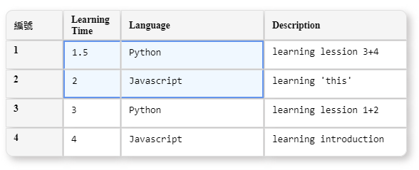

# [Table Form](https://github.com/Jchou24/table-form)

A simple excel liked form on Vue2.



[Interactive Online Demo](https://jchou24.github.io/Demos/TableForm/index.html)

[Quick Demo Video](https://jchou24.github.io/Demos/TableForm/Demo(2021-01-01).mp4)

# Installation

```bash
npm install -D jctk-table-form
```

# Quick Start

Initial library in main.js

```js
// main.js
import 'jctk-table-form'
import 'jctk-table-form/dist/jctk-table-form.css'
```

Use component in template

```html
<TableForm v-model="data" :options="options" />
```

Define data

```js
import FormSettings from 'jctk-table-form/src/components/ShareVar'

let options = {
    head:[{
            title: "Learning Time",
            relatedKey: "learningTime",
            cellType: FormSettings.cellTypes.number,
            style:{
                width: "80px",
                "min-width": "80px",
            },
            options:{
                step: 0.5,
                min: 0,
                max: 8,
            },
        },{
            title: "Language",
            relatedKey: "language",
            cellType: FormSettings.cellTypes.singleSelect,
            options: [{
                value: 0, name: '' },{
                value: 1, name: 'Python' },{
                value: 2, name: 'Javascript' },{
                value: 3, name: 'Java' },{
                value: 4, name: 'C#'
                }],
        },{
            title: "Description",
            relatedKey: "description",
            cellType: FormSettings.cellTypes.textarea,
            options:{
                maxLength: 20,
                isSuggestions: true,
                throttle: 250,
                suggestions: [ "learning refactoring" ]
            },
    }]
}

let data = [{
        learningTime: 1.5,
        language: 1,
        description: "learning lession 3+4",
    },{
        learningTime: 2.0,
        language: 2,
        description: "learning 'this'",
    },
],
```

# Props

## v-model

form data

* `type`: Array of Object

## options

form options

* `type`: Object

## options.head

form header options

define column order of form

* `type`: Array of Object(Head column options)

## Head column options

define column options

* `type`: Object

* `keys`:

  * style: Object, // { styleName: styleValue }

  * title: String, // display on head

  * cellType: String, one of the following value

    * FormSettings.cellTypes.number: "number",

    * FormSettings.cellTypes.singleSelect: "singleSelect",

    * FormSettings.cellTypes.textarea: "textarea",

  * option: Object,

    * FormSettings.cellTypes.number: `{ step, min, max }`

    * FormSettings.cellTypes.singleSelect: `[{ name, value }]`

    * FormSettings.cellTypes.textarea: `{ maxLength, isSuggestions, throttle, suggestions }`

## isReadonly

Set form readonly

* `type`: Boolean

## showSelection

Force table to show selection

* `type`: Boolean

# Events

* `@addRows`

  * `emit timing`: Add new row by

    * copy Paste to create new row

    * add new row

    * add new row from other table

  * `emit data format`: [{ newIndex }]

* `@removeRows`

  * `emit timing`: Delete Selected row(s) by

    * drag out row

    * shift + delete selected row(s)

  * `emit data format`: [{ oldIndex, value }]

    * ***drag out row wil get [{ oldIndex, value: {} }]***

* `@moveRows`

  * `emit timing`: Move row by

    * Same Table

      * move row

      * shift + delete selected row(s)

    * Cross Table

      * drag out row

      * add new row from other table

  * `emit data format`: [{ oldIndex, newIndex }]

* `@emptyCells`

  * `emit timing`: Empty cell(s) by

    * press delete to empty cell

  * `emit data format`: [{ rowIndex, relatedKey, oldValue, newValue }]

* `@modifyCells`

  * `emit timing`: Modify cell(s) by

    * Copy Paste to modify cell(s)

    * direct modify cell

  * `emit data format`: [{ rowIndex, relatedKey, oldValue, newValue }]

# Features

    <Header>
        1. [O] resize column head
        2. [O] resize row head
        3. [-] double click to max size of width/height
        4. [-] filter
        5. [-] sort

    <cell>
        <General Function>
            1. [O] is readonly
            2. [O] Display Mode
            3. [O] Edit Mode
            4. [-] Alignment(center, left, right)
        <Type>
            1. [O] Double
            2. [O] Single Select
            3. [O] Free Text
                [O] text autocomplete
            4. [-] CheckBox
            5. [-] DateTime

    <Selection>
        1. [0] show selections when focus table 
        2. [O] cell select
        3. [O] multiple cell select
        4. [O] keyboard arrow button, change selected cell
        5. [O] click row TH to select row
        6. [O] show selected cell border after table Focus
        7. [O] shift + left click to range set end selected cell
        8. [O] shift + arrow button to add new range set end selected cell

    <dragable row>
        1. [O] cross-table row drag
        2. [O] Handle case: index of row in currentCell >= number of row in data
        3. [O] drag new row when no row                

    <Copy Paste>
        1. [O] copy selected cell(s)
        2. [O] paste copied cell(s)
        3. [-] copy value of selected cell by clicking/dragging corner

    <right click to show helping menu>
        1. [O] copy selected cell(s)
        2. [-] paste selected cell(s)
        3. [-] cut selected cell(s)
        4. [O] delete selected cell(s)

    <others>
        1. [O] add new line
        2. [O] allow no rows
        3. [O] keyboard delete => set default value to selected cells
        4. [O] keyboard shift+delete => remove row(s) of selected cells
        5. [-] export csv format
        6. [-] specific column read only
        7. [-] add remove row button by config

    <History>
        1. [-] undo ctrl + z
        2. [-] todo ctrl + shift + z

